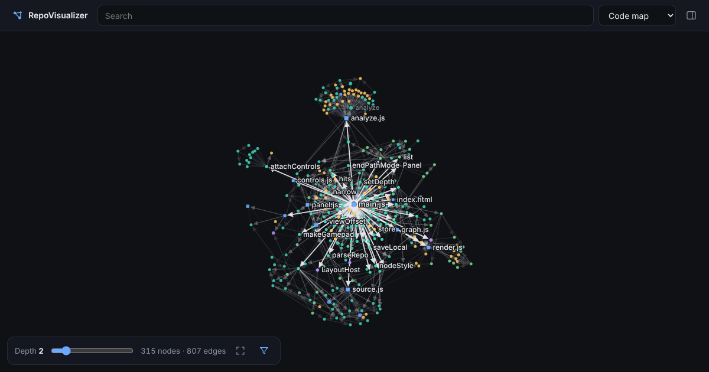

# RepoVisualizer

Explore a code repository as an interactive map of its files, functions, classes, variables and libraries, and how they connect.

**Open the app:** https://timothyhoytbsme.github.io/RepoVisualizer/

- Load any public GitHub repository (`owner/repo` or a link), or open a `.zip` / folder from your device. Local files never leave your device.
- Select a node to see its code in context; hover or long-press to peek. "Used by" entries show the line that uses it and open right at that line.
- Search by name (substring or fuzzy) or qualified name (`Flask.route`); results rank exact matches and the most used definitions first, and matching nodes light up on the map while you type.
- The depth slider controls how many steps away from the selected node are shown.
- Find how two things connect: Shift+click a node, or use the route button in the details panel (or G), to see the shortest path from the selected node.
- Follow only what a node uses, or only what uses it (impact), with the "Links followed" setting (or U).
- Arrows mean "uses / depends on"; plain lines mean "related" (a name match the analyzer couldn't pin down) or "contains".
- Works with mouse, touch, keyboard and gamepad. Runs entirely in the browser, with nothing to install.

Share a view with a link like `?repo=pallets/flask&node=f:src/flask/app.py&depth=2`.

## Maps

- **Code map**: functions, classes, methods, variables, files and libraries, linked by what uses what.
- **File map**: folders, files and libraries, with file-to-file dependencies.
- **Folder map**: folders and libraries only, with every dependency rolled up to folder level: an architecture overview.
- **Keyword map**: the distinctive words used across the code, linked to the files that use them.

The root folder's details show the language mix and the most used files and symbols (by how many other non-test files use them).

The funnel button shows or hides tests, variables, libraries, standard-library modules (hidden by default) and uncertain links, sets the direction and the node limit, switches node colors between kind and folder (to see module boundaries), saves the map as an image, and holds the color legend. When the limit trims a big neighborhood, labels show "+N" where nodes were hidden; click the +N (or press E on a highlighted node, or A on a gamepad when the selected node shows one) to show them in place. Press ? for all controls.

## Controls

| Action | Mouse / touch | Keyboard | Gamepad |
| --- | --- | --- | --- |
| Pan | drag | WASD / Shift+arrows | left stick |
| Zoom | wheel / pinch | + / − | triggers |
| Move highlight | — | arrows | D-pad / right stick |
| Select | click / tap | Enter | A |
| Back / forward | ‹ › in the details panel, browser back | Backspace, Alt+←/→ | B |
| Peek | hover / long-press | (highlight shows it) | (highlight shows it) |
| Depth | slider | [ / ] | LB / RB |
| Fit to screen | ⛶ button | F | Back/Select |
| Recenter | click the selected node | C | left stick press |
| Show hidden (+N) links in place | click / tap the +N | E (highlighted node) | A on the selected node |
| Color by kind / folder | filter menu | K | — |
| Links followed (both / uses / used by) | filter menu | U | — |
| Show/hide tests | funnel button | T | — |
| Details panel | tap the sheet | P | X |
| Switch map | menu | M | Y |
| Search | search box | / | — |
| Open repository | repo name in the top bar | O | Start |
| Path to another node | Shift+click, or the route button in the details panel | G (highlighted node, else search) | right stick press (highlighted node) |
| Controls help | Controls… in the filter menu | ? | — |

## How it works

Everything runs in the browser; there is no server.

1. **Load**: GitHub repositories are listed with one GitHub API call and downloaded from raw.githubusercontent.com. Very large repositories are trimmed to 6,000 files (code first, shallower folders first). Downloads are verified and saved on the device, so reopening a repository only fetches changed files and also works offline. Zips and folders are read locally.
2. **Analyze** (in a background worker): language rules find definitions (functions, classes, methods, variables, types), imports and references for JavaScript/TypeScript (including Vue, Svelte and Astro components), Python, Go, Rust, C/C++/Objective-C, Java/Kotlin/Scala/Groovy, C#, Swift, Dart, Ruby, PHP, Elixir, Lua, shell, SQL and more. References are resolved through imports (including re-exports, workspace packages and path aliases), packages, file scope, declared and inferred types (including collection element types and method call chains), class inheritance and overrides in subclasses; links that are only a name match are marked as uncertain (≈), and production code is never guessed to use test code.
3. **Lay out** (in a second worker): a force-directed layout arranges the selected node's neighborhood in rings by distance.
4. **Draw**: nodes and edges are drawn on the GPU with WebGL2 (or a 2D canvas where WebGL2 isn't available), labels with a canvas overlay.

## Development

No build step: serve the folder with any static file server and open it.

- `node tests/analyzer.test.mjs`: analyzer regression tests
- `node tests/loading.test.mjs`: zip reading and GitHub link parsing
- `node tests/browser.test.mjs`: end-to-end checks in headless Chromium (needs Playwright)
- `node tests/inspect.mjs <repo dir> [sum|refs|file|into|diff]`: inspect what the analyzer finds in a local checkout
- `tests/eval.sh <work dir> [save]`: clone 17 real repositories and compare analyzer output with a saved baseline

